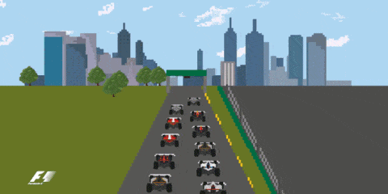
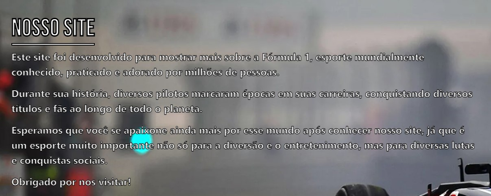
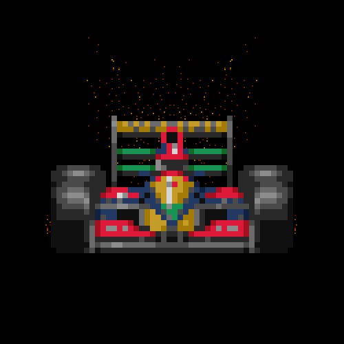

<h1 align="center">

</h1>

<h1 align="center">
</h1>

# 🏎 Indice 🏎

- [Sobre](#-Sobre)
- [Ferramentas utilizadas](#-Ferramentas-utilizadas)
- [Como baixar o projeto](#-Como-baixar-o-projeto)
- [Fontes de pesquisa](#-Fontes-de-pesquisa)
- [Desenvolvimento-do-site](#-Desenvolvimento-do-site)

---

## 🔎 Sobre 🔎



---

## 👩‍💻 Ferramentas utilizadas 👩‍💻

**O curso foi feito usando:**

- [Git](https://git-scm.com/)
- [GitHub](https://github.com)
- [VSCode](https://code.visualstudio.com/)
- [Bootstrap](https://getbootstrap.com.br/)
- [Parallax](https://pixelcog.github.io/parallax.js/)
- [Fontawesome](https://fontawesome.com/v5.15/icons?d=gallery&p=2)
- [GoogleFonts](https://fonts.google.com/)
- CSS
- HTML
- JavaScript

---


---

## 📰 Fontes de pesquisa 📰

- https://brasilescola.uol.com.br/educacao-fisica/formula-1.htm
- https://www.google.com/imghp?hl=pt-BR
- https://www.shutterstock.com/pt/
- https://unsplash.com/

---


---

## ✔ Desenvolvimento do site ✔

- **O site foi desenvolvido em dupla, facilitando a execução e o desenvolvimento do mesmo, visto que todos os membros do grupo cooperaram e conseguiram trabalhar em conjunto graças à boa comunicação e responsabilidade, sempre marcando reuniões e esclarecendo dúvidas em conjunto**
- **Para a execução do site, foram necessários 10 dias de desenvolvimento**

---



---

## 📩 Como baixar o projeto 📩

```bash
# Clonar o repositório
$ git clone https://github.com/GuiSalles/Curso-git.git

# Entrar no diretório
$ cd curso-git

# Outro método para download do código
- Acessar o repositório no Github > Abrir a aba Code > Download Zip
```

---

## 🧵 Desenvolvido por **[Guilherme Salles](https://www.instagram.com/gui__salles/)** e **[Gustavo Gimenez](https://www.instagram.com/ggimenezt/)** 🧵
